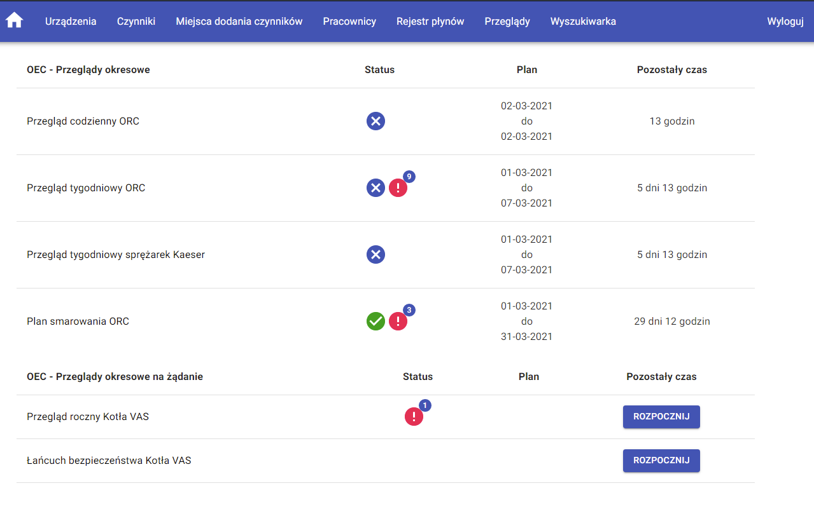

# SOIUM System

## Machine operation and maintenance system

### SOIUM system using: JAVA, Spring Boot Framework, JPA, Swagger, React, Redux

The system that I co-created for the company Krośnieński Holding Komunalny Sp.z o.o. It consists of a server application in JAVA language, which generates machine inspections at specified intervals, allows you to manage employees, machines and create new inspections. It also has mechanisms for automatic verification of the correct operation of the application. The second element is a client application written with the use of React and Redux libraries. It contains a module that allows you to perform current and overdue inspections, an extensive search engine for inspections, and several wizards that allow you to create and modify data. The system was implemented in the company in January 2021.

